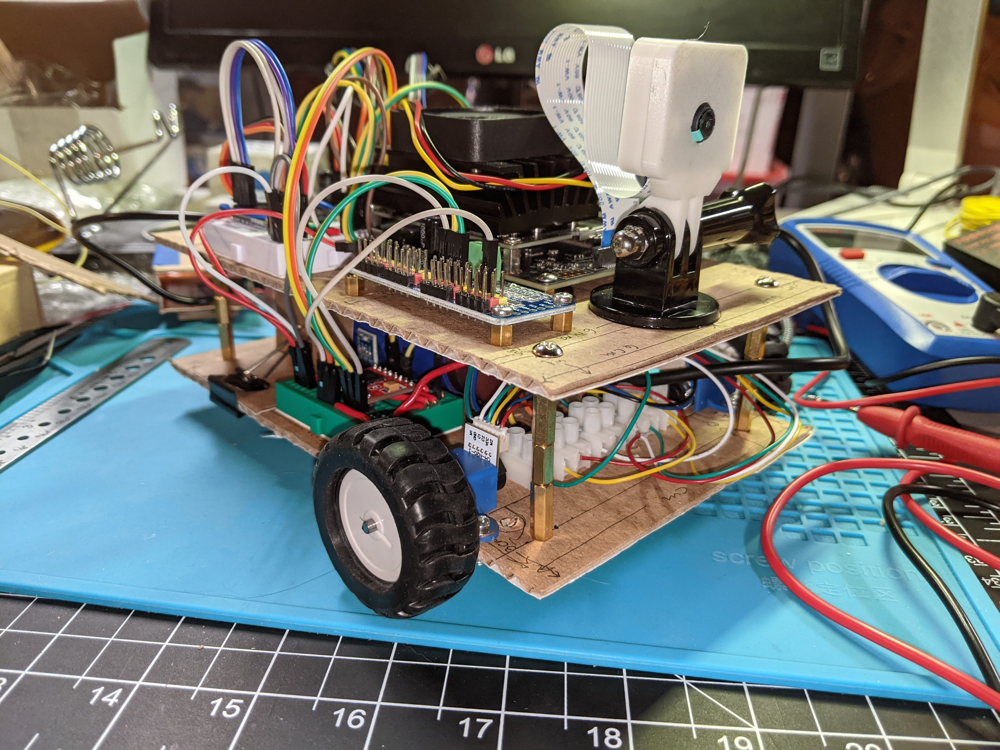

# DIYDuckie

This repo contains instructions for building a Duckiebot DB21M 'clone' from discrete modules available on Aliexpress or Amazon (or Ebay...)  [Duckiebot](https://get.duckietown.com/collections/dt-robots/products/duckiebot-db21-m) is a ROS-based robot used to teach autonomous robot navigation and behavior as part of the [Duckietown curriculum](https://www.duckietown.org/) and [MOOC](https://www.edx.org/course/self-driving-cars-with-duckietown).  


DIYDuckie cardboard prototype

Video of [DIYDuckie's first drive](https://youtu.be/LFufYF_5Ot4)

### Status
- Created a proof of concept by mounting parts on a pizza box.  All components worked; I could echo rostopic messages and see the parts in http://duckiebot.local/health/components (insert your duckiebot name for 'duckiebot').  Dashboard shows video and telmetry.  Motors move when using the `dts duckiebot keyboard_control` command.
- Did some initial layout experiments for a two-layer chassis using paper-cutouts of the parts.  Found that a 12cm wide x 17cm long chassis would work.  This could be made smaller if we can get rid of the second PCA9685; but that will have to wait until I have time to make a pull request to the project to support delivering PWM directly from the Jetson Nano.
- Created prototype using a cardboard chassis so I could finalize component placement and wire routing.  The cardboard layers make it easy to cut holes and fine-tune placements.  I have a layout that works.  I've tried a couple of power solutions. 
  - I first tried a 5v/5amp buck converter and an RC LIPO battery.  I've used that solution in other projects but here it did not work because routing the 5v into the Jetson Nano via the 40pin header would not boot the Nano.  This is apparently a common issue when trying to power via the 40 pin header using a buck converter.  So we really need to power the Jetson via the USB-C connector if we are using a battery.
  - Next I tried two USB batteries; one to power the Jetson Nano, the other to power everthing else.  This worked better, but still had a problem.  The Jetson Nano booted and ran well.  However, the USB batteries I am using would not see enough power pulled from the other modules and would shutdown.  If I ran the motors then everything was fine becaue enough power was being pulled to keep the battery awake.  But 10 seconds after I stopped the motors, the battery would go to sleep.  The other issue is these USB batteries are _heavy_, so the it's not great to require two of them.
  - I have two other buck-converter solutions on order that will terminate in USB connections, so I can feed the Jetson Nano via the USB-C connector.  I'm hoping I only need a single RC LIPO battery because the battery is the single heaviest component.  
- I solved the power issue by using an [Anker PowerCore 13000 USB Battery](https://www.amazon.com/gp/product/B00Z9QVE4Q/ref=ppx_yo_dt_b_search_asin_title).  This battery outputs 3 amps and has two USB ports, which made it easy to route power to the USB-C port on the Jetson Nano and to supply separate power for the Sensors, LEDs, and OLED screen.
- I created a new bottom platform using 1/8" hobby plywood.  I kept the upper platform in cardboard because it is plenty stiff and it is lighter than the plywood.  The battery resides on the bottom platform.  The remaining task is to mount the RGB LEDs, but that will be simple compared to everything else.
- I've been able to test the DIYDuckie in this new prototype and it works well.  It can be remote-controlled using the `dts duckiebot keyboard_control <duckiename>` command and video can be streamed in the dashboard.
- The next step is to modify the ROS code so apply the physical configuration of this robot; wheel radius/circumference, wheel base, min/max rpm of motors, number of encoder ticks per rotation.  This is all so the kinematic model and speed control will work correctly.  I think I may also need to set the offset of the camera from the robot center.
### To do
- [x] Finalize the power system.  That will then allow us to finalize the length on the stand-offs between the two layers.
- [x] Optimize the wire routing; use more solid core wiring so routing can be precise.
- [x] Create a hobby-board version of the chassis using the final component positions and wire routing.  This will be the first fully functional version and so I will add a lot more documentation and images on the build process.
- [ ] fork the dt-duckiebot-interface repo and modify it to allow PWM to be generate directly from the Nano.  Update the configuration to support a `diydb` model.
- [ ] redesign the chassis without the second PCA9685.
- [ ] Create a 3D printable chassis


## Parts


*   Jetson Nano 2GB
    *   [amazon](https://www.amazon.com/NVIDIA-Jetson-Nano-Developer-945-13541-0000-000/dp/B08J157LHH/ref=sr_1_3)
*   IMX219 camera with 160 degree wide angle lens
    *   This can be a Raspberry Pi v2 camera or one specifically created for the Jetson.
    *   You may need to buy the lens separately
    *   [amazon](https://www.amazon.com/Jetson-Nano-Camera-IMX219-160-8-Megapixels/dp/B07T43K7LC/ref=sr_1_1_sspa)
*   PCA9685 PWM/Servo controller * 2
    *   [aliexpress](https://www.aliexpress.com/item/32710084048.html)
    *   [amazon](https://www.amazon.com/Ximimark-PCA9685-Channel-12-Bit-Arduino/dp/B07FD6B45N/ref=sr_1_6?)
*   RGB LED modules x 5
    *   [aliexpress](https://www.aliexpress.com/item/32833188535.html)
*   TB6612FNG H-Bridge motor driver.
    *   [amazon generic](https://rads.stackoverflow.com/amzn/click/com/B08J3S6G2N)
    *   [amazon sparkfun](https://rads.stackoverflow.com/amzn/click/com/B07PV1S8HX)
    *   [aliexpress generic](https://www.aliexpress.com/item/1005001803735348.html)
*   D-shaft N20 Encoder motors x 2 
    *   [amazon](https://www.amazon.com/Reduction-Multiple-Replacement-Velocity-Measurement/dp/B08DKJT2XF/ref=pd_sbs_4)
    *   [aliexpress](https://www.aliexpress.com/item/4000830235298.html)
*   D-hole rubber wheel x 2
    *   [aliexpress](https://www.aliexpress.com/item/32769037524.html)
*   N20 Micro gear motor mount x 2
    *   [aliexpress](https://www.aliexpress.com/item/1005002088700878.htm)
*   Mini ball caster 
    *   [aliexpress](https://www.aliexpress.com/item/32827107261.html)
    *   [amazon](https://www.amazon.com/dp/B08N9PQDX7)
*   AMS1117 5v to 3.3v buck converter
    *   [amazon](https://www.amazon.com/gp/product/B08CDMZMDN/ref=ppx_yo_dt_b_asin_title_o02_s00)
*   I2C OLED display
    *   [amazon](https://www.amazon.com/SSD1306-Self-Luminous-Display-Compatible-Raspberry/dp/B08LYL7QFQ/ref=sr_1_1_sspa)
    *   [aliexpress](https://www.aliexpress.com/item/1005001636557498.html)
*   VL53L01X time of flight sensor.
    *   [amazon](https://www.amazon.com/HiLetgo-VL53L0X-Distance-Measurement-Breakout/dp/B071DW8M8V/ref=pd_sbs_6)
    *   [aliexpress](https://www.aliexpress.com/item/4000088283170.html)
*   5v Buck Converter (if you use a LIPO battery)
    *   [amazon](https://www.amazon.com/EPBOWPT-Converter-Regulator-Regulated-Transformer/dp/B01M0323MJ/ref=pd_rhf_se_s_rp_c_3_7)
*   TCA9548A I2C Multiplexer (only necessary if using more than one VL53L01X time of flight sensor)
    *   [aliexpress](https://www.aliexpress.com/item/4000067621113.html)
    *   [amazon](https://www.amazon.com/HiLetgo-TCA9548A-Multiplexer-Breakout-Expansion/dp/B06XXG5G3L/ref=sr_1_1_sspa)

## Related Repositories and Configuration

I reviewed the duckietown repos at[ https://github.com/duckietown](https://github.com/duckietown) to determine what hardware is used.

[https://github.com/duckietown/dt-duckiebot-interface](https://github.com/duckietown/dt-duckiebot-interface) This repo includes a number of packages to interface to hardware. This is where we will find the info on what we need to purchase to build a duckiebot from parts. What I don't see here is any driver for the IMU that is part of the DB21 duckiebot. So at this point I don't know which IMU is used, but it may not matter because I also cannot see here it would be used anyway. I would expect a node to read from the IMU and public imu messages and another node to use a Kalman Filter or other way to combine the IMU with encoder values to create pose estimates. So at this point I do not think the IMU is necessary, but I'll keep looking.

All the other hardware components can be easily obtained. I would look at all the config associated with the drivers below in order to figure out how to configure them. If need be, the configuration could be updated to match your hardware.


*   adafruit drivers includes several adafruit libraries
    *   [https://github.com/adafruit/Adafruit_Python_GPIO](https://github.com/adafruit/Adafruit_Python_GPIO)
    *   [https://github.com/duckietown/dt-duckiebot-interface/tree/daffy/packages/adafruit_drivers/include/Adafruit_PWM_Servo_Driver](https://github.com/duckietown/dt-duckiebot-interface/tree/daffy/packages/adafruit_drivers/include/Adafruit_PWM_Servo_Driver)
    *   [https://github.com/adafruit/Adafruit-Motor-HAT-Python-Library](https://github.com/adafruit/Adafruit-Motor-HAT-Python-Library)
    *   [https://github.com/duckietown/dt-duckiebot-interface/tree/daffy/packages/adafruit_drivers/include/Adafruit_I2C](https://github.com/duckietown/dt-duckiebot-interface/tree/daffy/packages/adafruit_drivers/include/Adafruit_I2C)
*   motor hat driver assumes a TB6612FNG motor driver chip. These are readily available modules.
    *   amazon generic:[ https://www.amazon.com/Dual-Motor-Driver-Module-TB6612FNG/dp/B08J3S6G2N/ref=pd_lpo_23_t_1/135-8668581-4375861](https://rads.stackoverflow.com/amzn/click/com/B08J3S6G2N)
    *   amazon sparkfun:[ https://www.amazon.com/SparkFun-Motor-Driver-TB6612FNG-Headers/dp/B07PV1S8HX/ref=pd_sbs_5](https://rads.stackoverflow.com/amzn/click/com/B07PV1S8HX)
    *   aliexpress generic:[ https://www.aliexpress.com/item/1005001803735348.html](https://www.aliexpress.com/item/1005001803735348.html)
*   wheel encoders module seems to assume a single GPIO pin per wheel, so cheap optical encoders should work. Specifically, it does not appear to be assuming a quadrature encoder. So a wheel that does have a quadrature encoder would simply hook up a single sensor, rather than two. The module config includes config for resolution and publication frequency, so those would probably need to be changed in that encoders on the output shaft are much lower resolution and so may also need a longer time between publishing (OR modify encoder module to include minimum tick count before publishing).
    *   [https://github.com/duckietown/dt-duckiebot-interface/blob/daffy/packages/wheel_encoder/src/wheel_encoder_node.py](https://github.com/duckietown/dt-duckiebot-interface/blob/daffy/packages/wheel_encoder/src/wheel_encoder_node.py) So I intend to use n20 motor with hall effect encoder like:
    *   amazon:[ https://www.amazon.com/Reduction-Multiple-Replacement-Velocity-Measurement/dp/B08DKJT2XF/ref=pd_sbs_4](https://rads.stackoverflow.com/amzn/click/com/B08DKJT2XF)
    *   aliexpress:[ https://www.aliexpress.com/item/4000830235298.html](https://www.aliexpress.com/item/4000830235298.html)

I would recommend a motor with the encoder on the motor's drive shaft rather than the output shaft because you will get many more ticks per revolution of the wheel. However,

I think generic gear motors with optical encoders would work if you tweak the config to handle the lower ticks/revolution of the wheel. See my project for sources for the motors, encoder wheels and optocouplers here:[ https://github.com/Ezward/Esp32CameraRover2/blob/master/docs/building_the_rover.md](https://github.com/Ezward/Esp32CameraRover2/blob/master/docs/building_the_rover.md)


*   servo driver looks like generic I2C PCA9685 server driver board. This is used to generate PWM signals using I2C commands. Duckiebot uses it to control LEDs (see LED emitter package).
    *   amazon generic:[ https://www.amazon.com/Organizer-Channel-PCA9685-Arduino-Raspberry/dp/B07Z8R2YB9/ref=sr_1_17](https://rads.stackoverflow.com/amzn/click/com/B07Z8R2YB9)
    *   aliexpress generic: https://www.aliexpress.com/item/4000468996665.html
*   camera-driver looks like it has config for either nano camera or raspberrypi v2 camera
    *   [https://github.com/duckietown/dt-duckiebot-interface/tree/daffy/packages/camera_driver/config](https://github.com/duckietown/dt-duckiebot-interface/tree/daffy/packages/camera_driver/config)
    *   [https://github.com/duckietown/dt-duckiebot-interface/blob/daffy/packages/camera_driver/include/camera_driver/AbsCameraNode.py](https://github.com/duckietown/dt-duckiebot-interface/blob/daffy/packages/camera_driver/include/camera_driver/AbsCameraNode.py)
*   display driver looks like an i2c oled display \

    *   [https://github.com/duckietown/dt-duckiebot-interface/blob/daffy/packages/display_driver/src/display_driver_node.py](https://github.com/duckietown/dt-duckiebot-interface/blob/daffy/packages/display_driver/src/display_driver_node.py)
    *   hat driver pulls together high level api for 3 hat versions. Probably important for motor config and control. depends on adafruit drivers. looks like it handles two wheels. \
[https://github.com/duckietown/dt-duckiebot-interface/tree/daffy/packages/hat_driver](https://github.com/duckietown/dt-duckiebot-interface/tree/daffy/packages/hat_driver)
    *   [https://github.com/duckietown/dt-duckiebot-interface/blob/daffy/packages/hat_driver/include/hat_driver/motor.py](https://github.com/duckietown/dt-duckiebot-interface/blob/daffy/packages/hat_driver/include/hat_driver/motor.py)
*   tof driver assumes a VL53L01X time of flight sensor on i2c bus. This is a cheap, readily available module.
    *   [https://github.com/duckietown/dt-duckiebot-interface/blob/daffy/packages/tof_driver/src/tof_node.py](https://github.com/duckietown/dt-duckiebot-interface/blob/daffy/packages/tof_driver/src/tof_node.py)
    *   amazon[ https://www.amazon.com/HiLetgo-VL53L0X-Distance-Measurement-Breakout/dp/B071DW8M8V/ref=pd_sbs_6](https://rads.stackoverflow.com/amzn/click/com/B071DW8M8V)
    *   aliexpress[ https://www.aliexpress.com/item/4000088283170.html](https://www.aliexpress.com/item/4000088283170.html)
*   wheels driver depends on hat drver.
    *   there are some hard coded calibration values that should be in config; in particular the min-pwm values (stall values) for the motors. If you use a different motor or battery than the DB21M, these values will probably differ. You may want to calibrate the min-pwm and change these values.
    *   [https://github.com/duckietown/dt-duckiebot-interface/blob/daffy/packages/wheels_driver/include/wheels_driver/dagu_wheels_driver.py](https://github.com/duckietown/dt-duckiebot-interface/blob/daffy/packages/wheels_driver/include/wheels_driver/dagu_wheels_driver.py)
*   button driver seems to respond to a button gpio by shutting down robot. Probably a kill switch. The config includes gpio for the button and for an led for feedback.
    *   [https://github.com/duckietown/dt-duckiebot-interface/blob/daffy/packages/button_driver/src/button_driver_node.py](https://github.com/duckietown/dt-duckiebot-interface/blob/daffy/packages/button_driver/src/button_driver_node.py)
*   led emitter controls 5 RGB LEDs (front: left,middle,right, back: left, right). These are controlled via the PCA9685 servo controller, which is an I2C device for generating PWM signals.
    *   [https://github.com/duckietown/dt-duckiebot-interface/blob/daffy/packages/led_emitter/src/led_emitter_node.py](https://github.com/duckietown/dt-duckiebot-interface/blob/daffy/packages/led_emitter/src/led_emitter_node.py)
    *   [https://github.com/duckietown/dt-duckiebot-interface/blob/daffy/packages/led_emitter/include/rgb_led/rgb_led.py](https://github.com/duckietown/dt-duckiebot-interface/blob/daffy/packages/led_emitter/include/rgb_led/rgb_led.py)

I found out the IMU is the MPU9250, which is very easy to get. However, it won't be used in this class. There is no code in the repositories that use it, but I do see that it tries to identify the IMU on startup (go to http://&lt;duckiebot>.local/health/components to see the components that the code is looking for and if it found them).


## Power

We use two separate 5v USB batteries; one supplies the power to the Jetson Nano and the other supplies the power to the LEDs and the Motors.  

The Jetson Nano is a 3.3v device; it's pins output 3.3v and when in input mode, it expects 3.3v logic.  It is NOT 5v tolerant.  This is important to note that the Jetson Nano is the I2C bus master; so it will be reading from the I2C bus.  Therefore, that bus must be 3.3v.  All the peripheral modules described below can operate their logic at 3.v or 5v, but we choose 3.3v to be compatible with the Nano.  

The exception is the TB6612FNG.  Due to power issues on the 3.3v rail (see below) we chose to power the TB6612FNG VCC using 5v.  This works because the TB6612FNG only takes inputs from the Jetson Nano and does not output anything back to the Nano, so 3.3v inputs are fine.

We did find that we needed to enhance the power to the 3.3v devices.  This was done because we were pulling too much power from the 3.3v rail and it was causing the OLED to flicker.  We had to add another 3.3v source to provide enough power; so one 3.3v rail is provided by the 3.3v output from the Jetson Nano, the other 3.3v rail is supplied by an [AMS1117 buck converter](https://www.amazon.com/gp/product/B08CDMZMDN/ref=ppx_yo_dt_b_asin_title_o02_s00) that takes the 5v source and brings it down to 3.3v.  Power was organized as shown below (we could probably balance the 3.3v a little more, but it seems to work ok like this):


*   3.3v rail from Nano 3.3v pin
    *   VCC - PCA9685 at address 0x40 providing PWM for RGB LEDs
    *   VCC - VL53L0X TOF Distance Sensor
*   3.3v rail from AMS-1117 buck converter OUT pin
    *   VCC - PCA9685 at address 0x60 that produces PWM for motors
    *   VCC - OLED display
    *   VCC - Motor A 
    *   VCC - Motor B
*   5v from USB battery 1
    *   VIN - PCA9685 at address 0x40 providing PWM for RGB LEDs
    *   VIN - PCA9685 at address 0x60 that produces PWM for motors
    *   VM - TB6612FNG motor voltage input
    *   VCC - TB6612FNG logic
    *   VIN - AMS1117 buck converter
*   5v from USB Battery 2
    *   Jetson Nano USB-C connector


## Wiring


### 1. PCA9685 PWM Controller

The PCA9685 can control up to 16 PWM devices like servos, motor controllers, LEDs or almost anything that uses a PWM signal.

Duckiebot uses this device to control 5 RGB LEDs.  Each LED has 3 control pins, so we end up using 15 channels.

This section is only about wiring the PCA9685 to the Jetson Nano.  There will be a separate section describing the wiring of the LEDs.


*   On I2C bus 1, address 0x40
*   On jetson nano, I2C bus 1
    *   SDA is pin 03
    *   SCL is pin 05
*   Wiring
    *   All GND must be common ground.
    *   External 3.3v power may be on shared bus.
    *   SDA and SCL may be through a shared bus rather than a direct connection between nano and PCA9685

```
---
    Nano   ... PCA9685 ... 5v
    pin-03 <---> SDA
    pin-05 <---> SCL
    GND-06 <---> GND 
    3v3-01 <---> VCC
                 VIN <---> 5v
                 GND <---> GND
---
```


*   checking connections
    *   ssh into the Duckiebot and use i2cdetect to read bus 1.  A device should exits at address 0x40


```
---
    $ i2cdetect -y -r 1
         0  1  2  3  4  5  6  7  8  9  a  b  c  d  e  f
    00:          -- -- -- -- -- -- -- -- -- -- -- -- -- 
    10: -- -- -- -- -- -- -- -- -- -- -- -- -- -- -- -- 
    20: -- -- -- -- -- -- -- -- -- -- -- -- -- -- -- -- 
    30: -- -- -- -- -- -- -- -- -- -- -- -- -- -- -- -- 
    40: 40 -- -- -- -- -- -- -- -- -- -- -- -- -- -- -- 
    50: -- -- -- -- -- -- -- -- -- -- -- -- -- -- -- -- 
    60: -- -- -- -- -- -- -- -- -- -- -- -- -- -- -- -- 
    70: UU -- -- -- -- -- -- --                         
---
```


Notes


*   Jetson Nano Pinout
    *   https://developer.nvidia.com/embedded/learn/jetson-nano-2gb-devkit-user-guide
*   related repos
    *   Adafruit_I2C
        *   [Adafruit_I2C.py:Adafruit_I2C()](https://github.com/duckietown/dt-duckiebot-interface/blob/daffy/packages/adafruit_drivers/include/Adafruit_I2C/Adafruit_I2C.py:Adafruit_I2C())
        *   forces I2C bus 1 (smbus(1)) for jetson nano
    *   Adafruit_PWM_Server_Driver:PWM
        *   [Adafruit_PWM_Servo_Driver.py:PWM()](https://github.com/duckietown/dt-duckiebot-interface/blob/daffy/packages/adafruit_drivers/include/Adafruit_PWM_Servo_Driver/Adafruit_PWM_Servo_Driver.py:PWM())
        *   defaults I2C address to 0x40
    *   Here is an [article](https://www.jetsonhacks.com/2019/07/22/jetson-nano-using-i2c/) on using the PCA9685 with the Jetson Nano.  Note that all of the permissions issues discussed in the article are already handled in the duckiebot image.


### 2. RGB LEDs

The RGB LEDs are driven by the PCA9685.  It takes 3 PWM channels to drive each LED.  The system supports 5 LEDs.


*   RGB_LED \
This class is used to drive a single rgb led using 3 channels on the PCA9685.
    *   [rgb_led/rgb_led.py](https://github.com/duckietown/dt-duckiebot-interface/blob/daffy/packages/led_emitter/include/rgb_led/rgb_led.py)
    *   instantiates PWM object with address=0x40
*   I'm using RGB LED modules with built-in resistors, so they are very easy to add with no soldering; just use dupont jumper wires.  Like these [https://www.aliexpress.com/item/32833188535.html](https://www.aliexpress.com/item/32833188535.html)
*   Wiring (using module above)


```
---
    PCA9685 <--> RGB LED
    pwm-0   <--> Front Left Red
    pwm-1   <--> Front Left Green
    pwm-2   <--> Front Left Blue
    GND     <--> GND
    pwm-3   <--> Rear Left Red
    pwm-4   <--> Rear Left Green
    pwm-5   <--> Rear Left Blue
    GND     <--> GND
    pwm-6   <--> Top / Front Middle Red
    pwm-7   <--> Top / Front Middle Green
    pwm-8   <--> Top / Front Middle Blue
    GND     <--> GND
    pwm-9   <--> Rear Right Red
    pwm-10  <--> Rear Right Green
    pwm-11  <--> Rear Right Blue
    GND     <--> GND
    pwm-12  <--> Rear Left Red
    pwm-13  <--> Rear Left Green
    pwm-14  <--> Rear Left Blue
    GND     <--> GND
---
```


### 3. OLED Display

The display is based on the SSD1306 chipset.


*   On I2C bus 1, address 0x3C
*   On jetson nano, I2C bus 1
    *   SDA is pin 03
    *   SCL is pin 05
*   Wiring
    *   All GND must be common ground.`
    *   SDA and SCL may be through a shared bus rather than a direct connection between nano and PCA9685`


```
---
    Nano   ... OLED
    pin-03 <-> SDA
    pin-05 <-> SCL
    GND-06 <-> GND 
    3v3-01 <-> VCC
---
```


- checking connections

  - ssh into the duckiebot and use i2cdetect to read bus 1.  A new device should exits at address 0x3C


```
---
    $ i2cdetect -y -r 1
         0  1  2  3  4  5  6  7  8  9  a  b  c  d  e  f
    00:          -- -- -- -- -- -- -- -- -- -- -- -- -- 
    10: -- -- -- -- -- -- -- -- -- -- -- -- -- -- -- -- 
    20: -- -- -- -- -- -- -- -- -- -- -- -- -- -- -- -- 
    30: -- -- -- -- -- -- -- -- -- -- -- -- 3c -- -- -- 
    40: 40 -- -- -- -- -- -- -- -- -- -- -- -- -- -- -- 
    50: -- -- -- -- -- -- -- -- -- -- -- -- -- -- -- -- 
    60: -- -- -- -- -- -- -- -- -- -- -- -- -- -- -- -- 
    70: UU -- -- -- -- -- -- --                         
---

```


*   related repos
    *   https://github.com/duckietown/dt-duckiebot-interface/blob/daffy/packages/display_driver/src/display_driver_node.py:DisplayNode()
    *   https://github.com/duckietown/dt-duckiebot-interface/blob/daffy/packages/display_driver/config/display_driver_node/default.yaml
    *   A DisplayNode() is instantiated using bus 1, address 0x3C as specified in the config.
    *   Here is a blog post on using a SSD1306 OLED display with the Jetson Nano: https://custom-build-robots.com/top-story-en/jetson-nano-oled-display-ssd1306/12124?lang=en#prettyPhoto


### 4. VL53L0X TOF Distance Sensor

The VL53L0X is a time-of-flight distance sensor using a 904nm laser emitter and detector.  It can measure distances up to 2 meters, which is plenty for Duckiebot.


*   On I2C bus 1, address 0x29  // see not below on discrepancy in config
*   Wiring
    *   All GND must be common ground.
    *   SDA and SCL may be through a shared bus rather than a direct connection between nano and PCA9685


```
---
    Nano   ... VL53L0X
    pin-03 <-> SDA
    pin-05 <-> SCL
    GND-06 <-> GND 
    3v3-01 <-> VCC
---

```


*   Related Repos
    *   [tof_driver/config/tof_node/front_center.yaml](https://github.com/duckietown/dt-duckiebot-interface/blob/daffy/packages/tof_driver/config/tof_node/front_center.yaml)
    *   [tof_driver/src/tof_node.py](https://github.com/duckietown/dt-duckiebot-interface/blob/daffy/packages/tof_driver/src/tof_node.py)
    *   This indicates bus 13, but I don't think the Jetson has a bus 13; I think it can only use bus 0 and 1.  There is an open bug related to this: [https://github.com/duckietown/dt-duckiebot-interface/issues/51](https://github.com/duckietown/dt-duckiebot-interface/issues/51) Apparently there is abn I2C multiplexer built into the HAT that makes this possible.
    *   I edited the `front_center.yaml` file to configure this for bus 1.
*   Checking Connections \
ssh into the duckiebot and use `i2cdetect` to read bus 1.  A new device should exist at address 0x29


```
---
    $ i2cdetect -y -r 1
         0  1  2  3  4  5  6  7  8  9  a  b  c  d  e  f
    00:          -- -- -- -- -- -- -- -- -- -- -- -- -- 
    10: -- -- -- -- -- -- -- -- -- -- -- -- -- -- -- -- 
    20: -- -- -- -- -- -- -- -- -- 29 -- -- -- -- -- -- 
    30: -- -- -- -- -- -- -- -- -- -- -- -- 3c -- -- -- 
    40: 40 -- -- -- -- -- -- -- -- -- -- -- -- -- -- -- 
    50: -- -- -- -- -- -- -- -- -- -- -- -- -- -- -- -- 
    60: -- -- -- -- -- -- -- -- -- -- -- -- -- -- -- -- 
    70: UU -- -- -- -- -- -- --                         
---

```


*   Notes
    *    Here is a [blog post](https://www.jetsonhacks.com/2016/11/20/single-chip-lidar-vl53l0x-nvidia-jetson-dev-kits/) on using the with a Jetson TK1.  The pinouts for the board are the same as on a Nano.


### 5. TB6612FNG Dual H-Bridge Motor Controller

This is used to control the 2 wheels on the duckiebot.


*   Related Repositories
    *   HatV3 allows for two potential configurations for motor control; one uses GPIO pins for the direction signals and the other uses the PCA9685 PWM controller to generate direction signals (by using a 100% duty cycle to logic high and 0% duty cycle for logic low)
    *   [hat_driver/hat.py](https://github.com/duckietown/dt-duckiebot-interface/blob/97373d8b2c9e641ea3a9d9366d84964506b36f08/packages/hat_driver/include/hat_driver/hat.py#L45) \
  hat.py makes it appear that one motor is using PWM mode and the other is using GPIO mode.  That is strange, but I've confirmed that is how it works.
    *   The code to control a single motor is here: [hat_driver/motor.py#L111](https://github.com/duckietown/dt-duckiebot-interface/blob/97373d8b2c9e641ea3a9d9366d84964506b36f08/packages/hat_driver/include/hat_driver/motor.py#L111)
    *   [wheels_driver/dagu_wheels_driver.py](https://github.com/duckietown/dt-duckiebot-interface/blob/905cbb08b5129624f69807d05f0ff58ab123d9cb/packages/hat_driver/include/hat_driver/hat.py#L45) instantiates 2 Motors; 

I figured out how the motor driver is wired and it is a little strange (see [https://github.com/duckietown/dt-duckiebot-interface/issues/53](https://github.com/duckietown/dt-duckiebot-interface/issues/53))  It appears that there is a second PCA9685 that is used to control the motors.  It's I2C address is set to 0x60 (this is done by closing the jumper pad 1+A5 with solder, see [https://learn.adafruit.com/16-channel-pwm-servo-driver/chaining-drivers](https://learn.adafruit.com/16-channel-pwm-servo-driver/chaining-drivers)).  

I really have no idea why one motor uses GPIO pins for direction and the other uses the PCA9685.  It makes no sense (which makes me question my understanding of it).

- NOTE: I could see using the PCA9685 to generate the PWM values for the motor controller, since it creates a high resolution, rock solid PWM signal which offloads that work from the Jetson nano.  I even think you could mix LEDs and motor pwm; they just need to operate on the same PWM frequency.  What I don't understand is why two different ways to support the direction pins for the two motors.  If we only have the one PCA9685, then just use GPIO pins for direction of both motors; that is only 4 pins and they are available.  On the other hand, if there is a second PCA9685 when there are plenty of channels on that, so why not use those for both motors?  Finally, the Jetson Nano does support 2 hardware PWM pins, so why not use those?  So the configuration is weird.  I think it is probably this way because the PWM class is written assuming a PCA9685.  I think it would be worth a pull request to modify the code to allow the Nano or RaspberryPi 4 to generate the PWM, since both have two hardware PWM pins available; that would allow the DIY Duckiebot to drop the second PCA9685.  For now I've included the wiring for the default configuration.  I've also annotated an alternative that would use the the second PCA9685 exclusively; you would need to change the default config to enable this mode.

Note: the TB6612FNG has a standby pin( STBY) that must be pull high to enable output to the motors, so below you will see it connected to +3.3v for this purpose.


##### Motor 1


```
---
    Nano ... PCA9685x60 ... TB6612FNG ... Motor A ... 5v ... 3.3v ... GND
                             VM  <------------------> 5v
                             VCC <------------------> 5v
                             GND <----------------------------------> GND 
                             STBY <------------------------> 3.3v
               ch-10 <-----> A-IN-1 
               ch-09 <-----> A-IN-2
               ch-08 <-----> PWM-A
                             A-OUT-1 <--> M2 motor +
                             A-OUT-2 <--> M1 motor -
    pin-19 <----------------------------> enc-2
    pin-23 <----------------------------> enc-1
                                          VCC <------------> 3.3v
                                          GND <--------------------> GND
---
```


##### Motor 2 (original code for DB21)


```
---
    Nano ... PCA9685x60 ... TB6612FNG ... Motor B ... 5v ... 3.3v ... GND
                             VM  <------------------> 5v
                             VCC <------------------> 5v
                             GND <----------------------------------> GND 
                             STBY <------------------------> 3.3v
               ch-13 <-----> PWM-B
    pin-33 <---------------> B-IN-1
    pin-31 <---------------> B-IN-2
                             A-OUT-1 <--> M2 motor +
                             A-OUT-2 <--> M1 motor -
    pin-24 <----------------------------> enc-2
    pin-18 <----------------------------> enc-1
                                          VCC <------------> 3.3v
                                          GND <--------------------> GND
---
```


##### Motor2 (modified to only use PCA9685 - required configuration change)


```
---
    Nano ... PCA9685x60 ... TB6612FNG ... Motor B ... 5v ... 3.3v ... GND
                             VM  <------------------> 5v
                             VCC <------------------> 5v
                             GND <----------------------------------> GND 
                             STBY <------------------------> 3.3v
               ch-03 <-----> B-IN-1
               ch-02 <-----> B-IN-2
               ch-01 <-----> PWM-B
                             A-OUT-1 <--> M2 motor +
                             A-OUT-2 <--> M1 motor -
    pin-24 <----------------------------> enc-2
    pin-18 <----------------------------> enc-1
                                          VCC <------------> 3.3v
                                      GND <--------------------> GND
---
```


In addition, these PWM channels are configured to be on a PCA9685 at address 0x60.  The first PCA9685 that we added is dedicated to 5 RGB LEDs, so 15 of the 16 available PWM channels are occupied, so there is not room on that PWM controller anyway.  So we need to add a second PCA9685 in order to support the default HAT configuration for the motor controller.


#### Add a second PCA9685 on bus 1 at address 0x60

By default the PCA9685 is at address 0x40.  However, there are a set of open jumper pads that can be used to alter the address by closing (soldering) the jumper pads.  The duckiebot software is setup to address this at 0x60.  Each pad adds a power of 2 to the default address of 0x40.  We can change the address of a PCA9685 to 0x60 by closing the  solder pad marked A5, which adds 2^5 = 0x20 to the address.  

See [https://learn.adafruit.com/16-channel-pwm-servo-driver/chaining-drivers](https://learn.adafruit.com/16-channel-pwm-servo-driver/chaining-drivers)

I then used jumper wires to carry across the 5v and GND from the original PCA9685 header (for LEDs) to the second PCA9685 header to get it power.

Hookup of VCC, GND, SDL and SCL are the same as the original PCA9685.

With this second PCA9685 in place, we can operate the motor controller as it is configured in the code by default.

After the second PCA9685 is in place, the i2c bus should look like this:


```
---
    $ i2cdetect -y -r 1
         0  1  2  3  4  5  6  7  8  9  a  b  c  d  e  f
    00:          -- -- -- -- -- -- -- -- -- -- -- -- -- 
    10: -- -- -- -- -- -- -- -- -- -- -- -- -- -- -- -- 
    20: -- -- -- -- -- -- -- -- -- 29 -- -- -- -- -- -- 
    30: -- -- -- -- -- -- -- -- -- -- -- -- 3c -- -- -- 
    40: 40 -- -- -- -- -- -- -- -- -- -- -- -- -- -- -- 
    50: -- -- -- -- -- -- -- -- -- -- -- -- -- -- -- -- 
    60: 60 -- -- -- -- -- -- -- -- -- -- -- -- -- -- -- 
    70: 70 -- -- -- -- -- -- --   
---
```


#### Generating PWM from the Jetson Nano

The duckiebot code always assumes that PWM is generated by a PCA9685.  However, if we were to generate PWM via the Jetson Nano GPIO header pins, then we would not need the second PCA9685.  This would require extending the HAT controller to configure and control hardware PWM pins on the Nano or RaspberryPi.  Both the Jetson Nano and RaspberryPi4 support two hardware PWM pins.  On the Jetsion Nano, these must be configured.

For now, I will use the second PCA9685 so we can use the Duckiebot code as-is.  Once I get that working, I will look at creating a pull request that would allow the Duckiebot to use two PWM pins on the Jetson and RaspberryPi4.


#### Configure Jetson Expansion Header for PWM

- ssh into the duckiebot and run this command `sudo /opt/nvidia/jetson-io/jetson-io.py`.  It should show the Jetson Expansion Header Tool that allows you to change GPIO pin functions (see below).

- If your Jetson expansion header configuration does not show any PWM pins, then you will need to enable them.


```
---
     =================== Jetson Expansion Header Tool ===================
     |                                                                    |
     |                                                                    |
     |                        3.3V ( 1)  ( 2) 5V                          |
     |                        i2c2 ( 3)  ( 4) 5V                          |
     |                        i2c2 ( 5)  ( 6) GND                         |
     |                      unused ( 7)  ( 8) uartb                       |
     |                         GND ( 9)  (10) uartb                       |
     |                      unused (11)  (12) unused                      |
     |                      unused (13)  (14) GND                         |
     |                      unused (15)  (16) unused                      |
     |                        3.3V (17)  (18) unused                      |
     |                      unused (19)  (20) GND                         |
     |                      unused (21)  (22) unused                      |
     |                      unused (23)  (24) unused                      |
     |                         GND (25)  (26) unused                      |
     |                        i2c1 (27)  (28) i2c1                        |
     |                      unused (29)  (30) GND                         |
     |                      unused (31)  (32) unused                      |
     |                      unused (33)  (34) GND                         |
     |                      unused (35)  (36) unused                      |
     |                      unused (37)  (38) unused                      |
     |                         GND (39)  (40) unused                      |
     |                                                                    |
      ====================================================================
---
```


Choose `Configure the 40 pin expansion header` to activate pwm0 and pwm1:


```
---
     =================== Jetson Expansion Header Tool ===================
     |                                                                    |
     |                                                                    |
     |                        3.3V ( 1)  ( 2) 5V                          |
     |                        i2c2 ( 3)  ( 4) 5V                          |
     |                        i2c2 ( 5)  ( 6) GND                         |
     |                      unused ( 7)  ( 8) uartb                       |
     |                         GND ( 9)  (10) uartb                       |
     |                      unused (11)  (12) unused                      |
     |                      unused (13)  (14) GND                         |
     |                      unused (15)  (16) unused                      |
     |                        3.3V (17)  (18) unused                      |
     |                      unused (19)  (20) GND                         |
     |                      unused (21)  (22) unused                      |
     |                      unused (23)  (24) unused                      |
     |                         GND (25)  (26) unused                      |
     |                        i2c1 (27)  (28) i2c1                        |
     |                      unused (29)  (30) GND                         |
     |                      unused (31)  (32) pwm0                        |
     |                        pwm2 (33)  (34) GND                         |
     |                      unused (35)  (36) unused                      |
     |                      unused (37)  (38) unused                      |
     |                         GND (39)  (40) unused                      |
     |                                                                    |
      ====================================================================
---
```


After enabling, pwm0 is pin-32 and pwm1 is pin-33.


### 6. Gear Motor and Quadrature Encoder

The motors I am using are n=N20 gear motors with hall effect quadrature encoders; like this [https://www.aliexpress.com/item/4000759558143.html](https://www.aliexpress.com/item/4000759558143.html)

The connector is labelled.  They come with a wire harness that plugs into the connector.  The wire color corresponds to the following:


```
---
    PIN   WIRE    PURPOSE
    M2:   red:    motor power '+'
    VCC:  black:  encoder power, 3.3v to 5v
    C2:   yellow: encoder output signal A
    C1:   green:  encoder output signal B
    GND:  blue:   encode power GND
    M1:   white:  motor power '-'
---
```


Encoder VCC should be in range 3.3v to 5V.  This will also determine the output value of the encoder signals A and B, so for our purposes we want those to be 3.3v so the Jetson Nano can read them safely.  So we need to provide 3.3v for encoder VIN.  This can be done using the 3.3v output pin in the Jetson Nano header.

Motor power can be whatever the motor is rated for.  In the case of these motors, that is 6v.  I will actually be using 5v because that is what I have readily available without having to introduce a voltage converter.  Remember that the Jetson Nano and the encoder must share a common ground.


